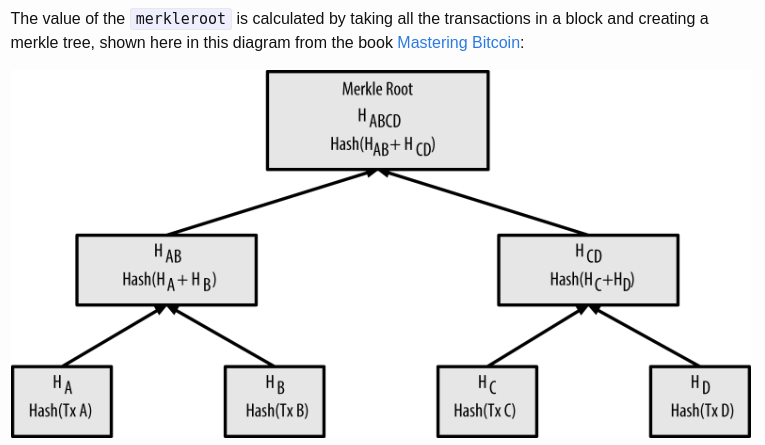
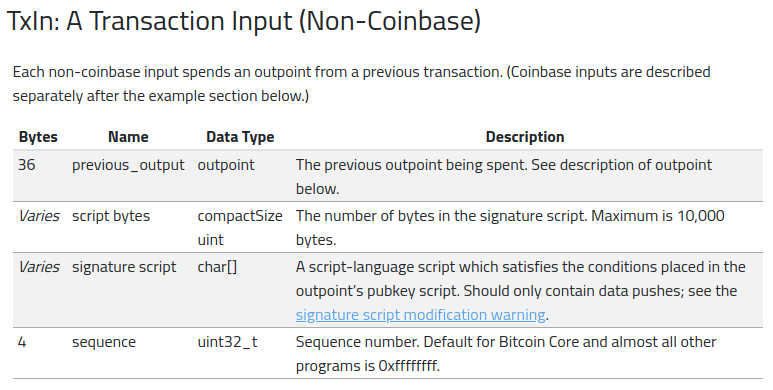
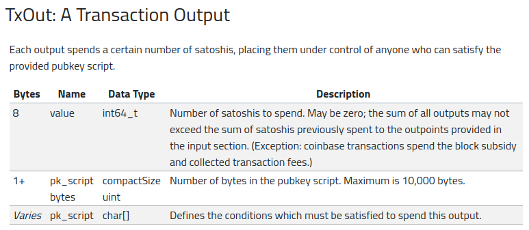
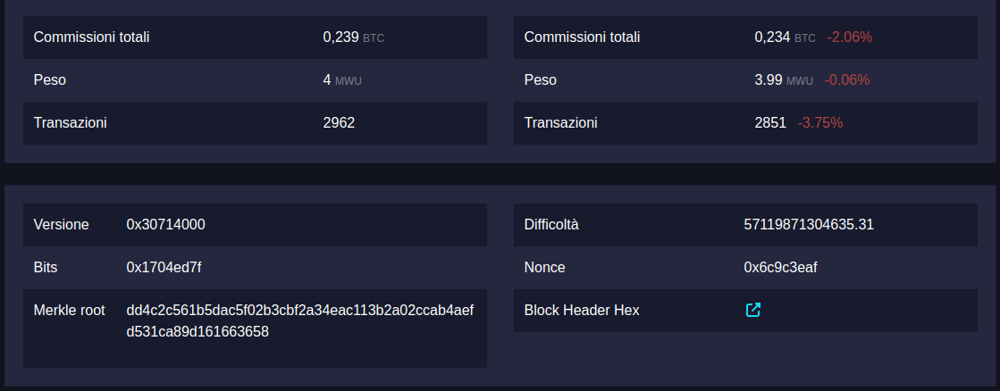

# OpenTimestamps: Scalable, Trust-Minimized, Distributed Timestamping with Bitcoin

OpenTimestamps è un progetto open-source che permette la creazione e la verifica di timestamp di file, utilizzando la blockchain Bitcoin.<br>
Un timestamp dimostra che un determinato dato esiste da un certo istante temporale in poi, infatti ci si riferisce spesso a una `"proofs-of-existence"`.<br>
Il concetto principale è quello di utilizzare una blockchain come un registro pubblico e immutabile per convalidare l'istante temporale (timestamp) in cui un determinato file è stato creato o modificato.<br>
Questo può essere utile in vari contesti, come la prova di esistenza di un documento in un momento specifico o la verifica dell'integrità di dati digitali nel tempo.

Le caratteristiche principali di OpenTimestamps sono:

-	Open-Source: Il progetto è open-source, quindi il codice sorgente è disponibile pubblicamente a tutti, per cui chiunque può ispezionare il codice e contribuire al progetto.
-	Decentralizzato: OpenTimestamps consente gratuitamente a chiunque di creare timestamp utilizzando la blockchain Bitcoin, senza la necessità di avere un'autorità esterna che confermi la transazione.
-	Interoperabilità: Gli orari generati da OpenTimestamps sono indipendenti dalla blockchain e possono essere verificati persino offline.
-	Flessibilità: È possibile utilizzare OpenTimestamps per creare timestamp di dati di qualsiasi tipo, inclusi file, documenti, transazioni Bitcoin e altro ancora.
-	Immutabilità: Una volta registrato un timestamp sulla blockchain, esso non può più essere modificato o cancellato, il che fornisce una prova pubblica dell'istante di tempo in cui i dati sono stati convalidati.

Per poter utilizzare OpenTimestamps, è necessario un client OpenTimestamps che può essere eseguito da riga di comando o utilizzato tramite librerie. Sono disponibili client realizzati con linguaggi di programmazione differenti (Python, Javascript e Java).

Opentimestamps utilizza quattro Calendar gratuiti per la gestione delle transazioni sulla blockchain. Per il supporto del progetto, sono accettate donazioni in Bitcoin o attraverso pagamenti sulla lightning network.

I Calendar disponibili sono i seguenti:
-   Alice : <a href="https://alice.btc.calendar.opentimestamps.org/" target="_blank">https://alice.btc.calendar.opentimestamps.org/</a>
-   Bob : <a href="https://bob.btc.calendar.opentimestamps.org/" target="_blank">https://bob.btc.calendar.opentimestamps.org/</a>
-   Finney : <a href="https://finney.calendar.eternitywall.com/" target="_blank">https://finney.calendar.eternitywall.com/</a>
-   Catallaxy : <a href="https://ots.btc.catallaxy.com/" target="_blank">https://ots.btc.catallaxy.com/</a>

Per altri dettagli sul progetto : <a href="https://petertodd.org/2016/opentimestamps-announcement" target="_blank">Click here</a>

## Come eseguire il Timestamping

In questo progetto verrà utilizzato il client realizzato in Python disponibile su Github al seguente link : <a href="https://github.com/opentimestamps/opentimestamps-client" target="_blank">https://github.com/opentimestamps/opentimestamps-client</a>

Requisiti : `Python` e `pip` (per installare il client)

Per poter installare il client, bisogna eseguire il comando:

```bash
pip3 install opentimestamps-client
```

A seguito dell'installazione, è possibile utilizzare il comando `ots`.<br>
Scegliere/creare un file per cui si vuole eseguire il `Timestamping` e eseguire il comando:

```bash
ots stamp NOME_FILE
```

Il comando riprodurrà in output su terminale le seguenti informazioni:

```
Submitting to remote calendar https://a.pool.opentimestamps.org
Submitting to remote calendar https://b.pool.opentimestamps.org
Submitting to remote calendar https://a.pool.eternitywall.com
Submitting to remote calendar https://ots.btc.catallaxy.com
```

A questo punto viene eseguito un algoritmo di `"hashing"` (sha256) sul file originale, il quale riproduce in output una stringa di lunghezza fissa (64 caratteri in esadecimale) chiamata `"hash"`, che rappresenta un'impronta digitale univoca del file.<br>
Per registrare il timestamp su una transazione sulla blockchain Bitcoin, viene generato un file con estensione `.ots`, che contiene le informazioni riguardo il timestamp.<br>
Con il comando:

```bash
ots verify NOME_FILE.ots
```

è possibile verificare lo stato attuale del `Timestamping` nei quattro Calendar.<br>
Inizialmente lo stato dell'operazione è `"Pending confirmation in Bitcoin blockchain"`, infatti compariranno le seguenti informazioni:

```
Calendar https://finney.calendar.eternitywall.com: Pending confirmation in Bitcoin blockchain
Calendar https://btc.calendar.catallaxy.com: Pending confirmation in Bitcoin blockchain
Calendar https://bob.btc.calendar.opentimestamps.org: Pending confirmation in Bitcoin blockchain
Calendar https://alice.btc.calendar.opentimestamps.org: Pending confirmation in Bitcoin blockchain
```

La conferma del timestamp sulla blockchain Bitcoin richiede alcune ore, perché Opentimestamps non esegue una transazione per timestamp, bensì combina un numero illimitato di timestamp in un unica transazione.<br>
Quando la transazione viene inclusa in un blocco valido e confermata sulla blockchain, il timestamp è considerato ufficialmente convalidato.<br>
Con il comando:

```bash
ots info NOME_FILE.ots
```

vengono mostrate ulteriori informazioni sul timestamp:

```
File sha256 hash: HASH_DEL_FILE
Timestamp:
append 342520a60108b9bb0e60e58ffe935028
sha256
 -> append 0d0ecc37d85914e56f7c2dfbfa70a393
    sha256
    append b940e77dc58d63bc3f0c55287675ea2a80705d621c5717898f1f5e3dcdce92e7
    sha256
    prepend 650c647c
    append 3bf4a8efa56973c9
    verify PendingAttestation('https://finney.calendar.eternitywall.com')
 -> append 3d073dd138ca5507fa96c927a28fa66a
    sha256
    prepend 650c647b
    append 07c5d73ea439a880
    verify PendingAttestation('https://btc.calendar.catallaxy.com')
 -> append 98760502f0e2d90937a14e3cd891c1b5
    sha256
    prepend 650c647c
    append 825ebdd65b77798c
    verify PendingAttestation('https://bob.btc.calendar.opentimestamps.org')
 -> append d1562fd14b867a97dce1e03453049da4
    sha256
    prepend c8def71aee9679cb6fbaef9863e8a15f0393ffc310e70ae683c1b36ad81d3bdb
    sha256
    append 72e15a4e4e5cf2b784915153eb67c269e9f13efcf0bc5fe5a9137f652d59c524
    sha256
    prepend 650c647c
    append bfd5269e6aac8cd0
    verify PendingAttestation('https://alice.btc.calendar.opentimestamps.org')
```

Se il timestamp è stato confermato dalla blockchain, compariranno anche le informazioni sul blocco e sulla transazione.<br>
Qui, è possibile verificare l'id della transazione e il numero del blocco, che hanno convalidato il timestamp.<br>
Di seguito è presente un esempio:

```
File sha256 hash: HASH_DEL_FILE
Timestamp:
append 342520a60108b9bb0e60e58ffe935028
sha256
 -> append 0d0ecc37d85914e56f7c2dfbfa70a393
    sha256
    append b940e77dc58d63bc3f0c55287675ea2a80705d621c5717898f1f5e3dcdce92e7
    sha256
    prepend 650c647c
    append 3bf4a8efa56973c9
    verify PendingAttestation('https://finney.calendar.eternitywall.com')
    sha256
    prepend 013b53477992e3207aef3d2496fbe70883333801ad39f4b4b65df64841368144
    sha256
    prepend 2f5550369ba63ba1245ea93eb09e3f5774124d82d715256a2d0111e3332b31c3
    sha256
    prepend 5241928ee27083040935cc30a978ace32d63c88bb942cddf370022836e3282a7
    sha256
    prepend 1fd844151c30215713e6d2b732c3e192ce4789610cb86c3a8b3b36e6e9da89fa
    sha256
    append 956ef5b65aceb99ba4a4a45261f5f9d5ab4e7448e53faa77ff7d0422c8636410
    sha256
    append d9604afb03e8262e4dd240eb7d858665d89fb3bbed7b614561ebe72dce1261aa
    sha256
    append 606cdfa3f8ecb2aadd2fa6721fbed7c691dce35e969c86a004b60e51744a494a
    sha256
    prepend a50d242454568c5cc859178927a99a54428c7c2e8887bbf7c9af17632fe5b372
    sha256
    append 6a28244ebc79a99ac6901f2d149d8dd2dadacd68cf8670dead00c9c86dcd5920
    sha256
    prepend 015f6485775fa6f3b4103bd4461dbee6a30dede8f16ce5e7e5d854be150f542b
    sha256
    prepend 423540d2d56afa98727a126876aa3bab94d37bca7315021b3c0403164ccb8917
    sha256
    prepend 33f90efdfbc72f0734745b76fd1e46d549a042320ed9eedef18859b50a40a9a2
    sha256
    append d7d70698e552cc88abbd60dbc6777364883b0e88a5112751a5e2abe3c469d522
    sha256
    append e68d675f7466ebbe6c1dec5a65fa6071addc7bf263c833b3431bfe26e335a861
    sha256
    prepend a59666eba9c0cffb3a93eee2419509be256e354cab56f60e354d89f5addd7d8a
    sha256
    prepend 0100000001982a38c039312303c0e38f3d2ca9d6ce9452f840c3a2bd3d4d27a6801808a9510000000000fdffffff02ae20010000000000160014fb589ec155276d39c49e53949fe692e7230d69a00000000000000000226a20
    append 29570c00
    # Transaction id 95f612d2a8ee2f1d786abb05186b71db912dbdfe030b20fdf73650e1b9473f0c
    sha256
    sha256
    append 2f2b956f1a6ed68b4b918d96cd0d4fd8d945c5b3fe909e2893242f5b27b006cc
    sha256
    sha256
    prepend 5204d55d2f33f5a68b6234dc37e6280b95df70e271727f182531f326975eb15b
    sha256
    sha256
    append 82868a6aa14892a1dcd27e31655ec6673df3e96e57502400bc724a252b0ed165
    sha256
    sha256
    prepend 655957c9514071698b9c443ffbc97550360652755190471c41958a3a04ee515c
    sha256
    sha256
    append 7fc05928a15d17e69b5b6a201617b4bf0d2869a3d0d2f56d56e629b91cea39e4
    sha256
    sha256
    append cf16dd278904d02e862c137746b869b9447f4a09c5dcb3818c49d83f1ace1d51
    sha256
    sha256
    prepend 9e3a5eb01ad0358db580412651a6ce73c250fb94f52865d509cd451cad27fe3d
    sha256
    sha256
    prepend b67686a44f6e7e77862a91c98053c5eb26fbc6b8726d406ff6a68c6289bf361e
    sha256
    sha256
    append c1ddb27e8049f536c406e3612bfacc07930347d701c7a401d6fa4c9800a8089d
    sha256
    sha256
    append 23763cddb1aaa889eb7f974eb1500b94882edc922f9b390762097a799b7635e2
    sha256
    sha256
    append 3d282e8c4728f39d73a9fee4294336458c76384a7ec9e8e90da38b631f6d1a3f
    sha256
    sha256
    prepend 1fce1aef294053e0a950c448f1ed28383da04dd37e1abb2f905c1e2ca8546ef3
    sha256
    sha256
    verify BitcoinBlockHeaderAttestation(808746)
    # Bitcoin block merkle root 2e81f9bf4921066ea2d0d8d1d892042421bb58c6ff52ba555335fda2ac9a399b
 -> append 3d073dd138ca5507fa96c927a28fa66a
    sha256
    prepend 650c647b
    append 07c5d73ea439a880
    verify PendingAttestation('https://btc.calendar.catallaxy.com')
 -> append 98760502f0e2d90937a14e3cd891c1b5
    sha256
    prepend 650c647c
    append 825ebdd65b77798c
    verify PendingAttestation('https://bob.btc.calendar.opentimestamps.org')
    sha256
    append b583ae92fab8103639db0e29a3440318df95125d5bc79b78d7420b60f43992fd
    sha256
    append d4acf72d39317b4c00a7056bf577739a9c0526900512994e42de73814436e818
    sha256
    prepend 66a7bf2336d8b514377cf7b3dc7ee968c68fd54d207ffd5db14ed9abab53d3a0
    sha256
    append b4f346556e5465206e7c800f22ab18a11292cfba0f57826843ba4191e205ee43
    sha256
    append dd167708239b7c615d33c2209ed3ed85002b59f4570a51ed5657000c9f297037
    sha256
    append 343ce4ff12626a1305ac2dc497c9a4100f8b35f93b734c935ffefab9e643d99b
    sha256
    append 59db43504bddb67460da1753780ec00fb4880256cb4bcb8b9b6f88d6f2bfcd59
    sha256
    append 4d09d3d93ff611b4207b129b2cbfcbad2cbb5f828160d3027b9b88f60539502b
    sha256
    prepend 61600b1495b98dc624ea904da9399a274bcb7a3456cff9d48d0275c25083d373
    sha256
    append 1ccaff46d9370391fdcf5c778ee040a129a1179d0abe4556070618ddc4cab47b
    sha256
    append 037a76de855875bc328221713fd7d9b6cdc7d1710289c274bc0b594b7900700f
    sha256
    prepend c91c4bb3bc89bed9620b940149270d223b5d58852febd9b653b80f7d293e9baa
    sha256
    prepend 0a76660bc06f0f666206da9fc0e7581b64ec391e97d1ba6ad9c953846c569eaa
    sha256
    prepend ecd94944cc3788297a771bc173c45480061830f6239ded2624489f014f4ed829
    sha256
    append 8fe33d135d6a8ef9e97b2639e009363c577fb4db103a9d19e1b91c1a536c8b61
    sha256
    prepend 01000000010a697f4f3788fbf652d50f7fb879505f1ccb2a10c1f09c96af56da5e99595e390000000000feffffff02b0d7030000000000160014565c98b6d5cdf7bd05aafc94100803abd65c12570000000000000000226a20
    append 2f570c00
    # Transaction id 79104b9fb655aae01363ccf52d559bc1826d706ac424bad3002251f7cc6eeec8
    sha256
    sha256
    prepend 0fdc43f872168bf5b471c652e5922b7609a03e5c55198686e83bde20291ce40a
    sha256
    sha256
    prepend 97790d3dbf2a03ca7d1c19511ab8b44029518db0ed56962ac9643872b4dc29d9
    sha256
    sha256
    prepend dd44f9b1f7a0a1ffa0253bc02f794cd0244cf6fd485767cdf85d51c1aa5e122b
    sha256
    sha256
    prepend d15ce944c2817f6f83eb328b0260dad3a74188baf9da7443c37abf832c046e72
    sha256
    sha256
    prepend ff769bdbb513bf0c330c44594d4486200916411dc72f4bec0e9a5f6a98bdff0f
    sha256
    sha256
    prepend 32334333f1d9813d496d685dfcef71c67c8a2d57d78e37fd33a6ae7b9c5c3af7
    sha256
    sha256
    append e5729f667d3ba97060a00444643536242b530e45acd817e5a373ac787d65916b
    sha256
    sha256
    prepend c37b73b404d7a50a8c28bbe3f61417244cbc0ec185477131c120dc7c2f64d822
    sha256
    sha256
    append a265324b1941399b78d00114d73d21e7e67cc9e14fc7e55c3ce3eedbb6c6be55
    sha256
    sha256
    append ea56bfd7531aaa04d9d627660928ce881baa80b8cd2a3390d8dd82b995141e7c
    sha256
    sha256
    append 5058a2075df3615a7e101429391aaa70db8386fd91352ea5fddc0e3ff16b5c2f
    sha256
    sha256
    append c8f41dab21d3b0c619b2abc770ead4a05a87ba80911272b2355292fa45d7eca8
    sha256
    sha256
    verify BitcoinBlockHeaderAttestation(808752)
    # Bitcoin block merkle root dd4c2c561b5dac5f02b3cbf2a34eac113b2a02ccab4aefd531ca89d161663658
 -> append d1562fd14b867a97dce1e03453049da4
    sha256
    prepend c8def71aee9679cb6fbaef9863e8a15f0393ffc310e70ae683c1b36ad81d3bdb
    sha256
    append 72e15a4e4e5cf2b784915153eb67c269e9f13efcf0bc5fe5a9137f652d59c524
    sha256
    prepend 650c647c
    append bfd5269e6aac8cd0
    verify PendingAttestation('https://alice.btc.calendar.opentimestamps.org')
```

Andando sul Calendar che ha gestito il `Timestamping` e cliccando sull'id della transazione corrispondente, si viene reindirizzati su una pagina web relativa al sito <a href="https://mempool.bullBitcoin.com/" target="_blank">mempool</a><br>
Nota: per saltare questo passaggio, andare direttamente all'url - https://mempool.bullBitcoin.com/it/tx/ID_TRANSACTION<br>
Nota 2: è comunque possibile verificare la transazione sulla blockchain Bitcoin su un qualsiasi explorer.

### Come possiamo capire se il timestamp del file ha avuto successo ?

Nelle informazioni precedenti è presente una sequenza di caratteri chiamata `merkle root`.<br>
Questa stringa è calcolata prendendo in considerazione tutte le transazioni presenti in un blocco e creando un `merkle-tree`.<br>
Viene eseguita una procedura di `hashing` a cascata, combinando gli `hash` delle singole transazioni e concatenandoli.<br>
L'immagine seguente è una rappresentazione grafica della procedura:


Di seguito due link con una spiegazione più dettagliata :
-  <a href="https://petertodd.org/2016/opentimestamps-announcement#merkle-trees" target="_blank">Click here</a>
-  <a href="https://developer.bitcoin.org/reference/block_chain.html#merkle-trees" target="_blank">Click here</a>

Sostanzialmente, se l'`hash` del nostro file non fosse stato preso in considerazione durante questa procedura di `hashing`, allora il `merkle root` finale sarebbe stato completamente diverso.<br>
Questo è quindi la prova dell'esistenza del file quando il blocco è stato creato e validato sulla blockchain.

Per poter verificare tutto ciò, basta semplicemente ripetere tutte le operazioni presenti nella procedura di `hashing`.<br>
Il risultato finale sarà esattamente lo stesso valore definito precedentemente nel tempo dal `merkle root`.

## Transazioni
La transazione generata contiene differenti dati. Il formato di base è il seguente:


Considerando come esempio una delle transazioni precedenti : <a href="https://mempool.bullbitcoin.com/it/tx/79104b9fb655aae01363ccf52d559bc1826d706ac424bad3002251f7cc6eeec8" target="_blank">here</a><br>
È possibile notare le informazioni riportate nell'immagine precedente tra cui gli `input`, gli `output` e i relativi indirizzi.

Gli `input` all'interno di una transazione seguono il seguente formato:


Invece, gli `output` all'interno di una transazione seguono il seguente formato:


Le informazioni riportate sono documentate in modo approfondito al seguente link : <a href="https://developer.bitcoin.org/reference/transactions.html#raw-transaction-format" target="_blank">here</a>

Il blocco, oltre a contenere tutte le transazioni, contiene anche altre informazioni importanti tra cui la `difficulty`, il `nonce` utilizzato, l'`header` e il `merkle root` citato precedentemente.
Di seguito un esempio di blocco : <a href="https://mempool.bullbitcoin.com/it/block/000000000000000000014d50af7ea61f3aa5ca4bbd070723d5c0b90dbf53afd4?showDetails=true&view=actual#details" target="_blank">here</a>


## Utilizzo
In questo repository sono disponibili dei file di vario formato nella directory `src/`.<br>
Per ciascuno di essi, è stato eseguito il `Timestamping` e i file `.ots` si trovano nella directory `dist/`.<br>
Per ciascun file, sono state eseguite tutte le operazione precedentemente descritte con il client in `Python`.<br>
Tutti i file, quindi, sono stati convalidati con delle transazioni, per cui la creazione dei file e l'integrità di essi è confermata dalla blockchain.
